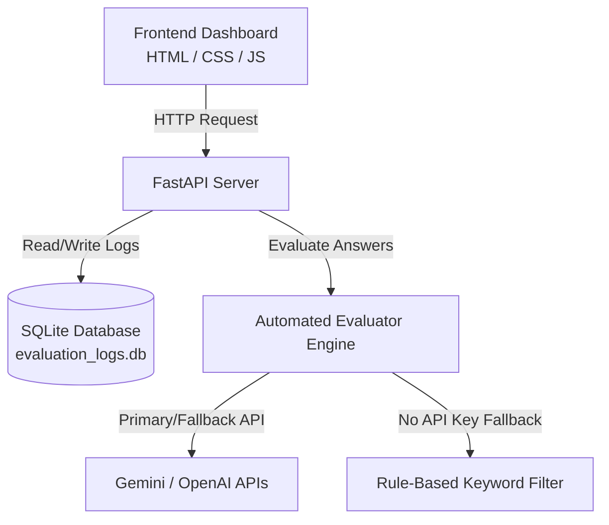

# AI Response Quality Dashboard

An interactive, premium dashboard to monitor, search, and analyze automated candidate technical answer evaluations.

Serves as an analytics interface for the automated answer evaluation engine, highlighting scoring patterns, confidence distributions, and database queries.

## Key Features

1. **KPI Statistics Cards**: Monitor total evaluations, average scores, mean evaluation confidence, and LLM vs Rule-Based breakdown ratio.
2. **Dynamic Charting**:
   - **Score Distribution**: Histogram grouping scores from 0 to 10.
   - **Domain Breakdown**: Donut chart detailing proportions of DSA, DBMS, and OS questions.
   - **Score & Volume Trend**: 30-day timeline showing average evaluation score and request counts per day.
   - **Method Proportions**: Visualizing LLM API usage vs fallback rule-based matching.
3. **Advanced Log Explorer**:
   - Live text search across all questions, answers, and feedback text.
   - Filtering by domain (DSA, DBMS, OS), evaluation method, and score ranges.
   - Full sorting support on ID, Timestamp, Domain, Score, Confidence, and Method.
   - Detail inspect modal with full text viewing.
4. **Live Interactive Sandbox**: Submit new answers for automated evaluation directly from the UI and see results reflected instantly.
5. **No Heavy Database Setup**: Uses a local SQLite database (`evaluation_logs.db`) with automatic table creation and schema init on startup.

---

## Architecture



---

## Setup & Running Guide

### 1. Requirements

- Python 3.10 or higher
- API keys (at least one of OpenAI or Gemini) to run LLM evaluations. (The system degrades gracefully to the rule-based keyword filter if keys are absent.)

### 2. Install Dependencies

Install the requirements from the root of the project directory:

```bash
pip install -r requirements.txt
```

### 3. Configuration

Configure your environment keys inside the `.env` file in the root directory:

```env
# API Keys
GEMINI_API_KEY=your-gemini-key
OPENAI_API_KEY=your-openai-key

# Configuration Options
LLM_PROVIDER=gemini       # preferred model provider: gemini or openai
GEMINI_MODEL=gemini-2.5-flash
OPENAI_MODEL=gpt-4o-mini
MIN_RELEVANCE_THRESHOLD=0.1
DB_PATH=evaluation_logs.db
```

### 4. Running the Dashboard

Start the application with the startup script:

```bash
./run.sh
```

Or run manually:

```bash
PYTHONPATH=. uvicorn app.main:app --reload --port 8000
```

> **Note**: On the very first run, `run.sh` will automatically run `app/seed.py` to seed the database with **50 mock evaluation logs** spanning the last 30 days. This populates your charts and logs instantly!

- **Dashboard UI**: [http://127.0.0.1:8000/dashboard](http://127.0.0.1:8000/dashboard)
- **API Documentation**: [http://127.0.0.1:8000/docs](http://127.0.0.1:8000/docs)

---

## Running Unit Tests

Run the test suite to verify correctness:

```bash
python3 -m pytest tests/ -v
```

All unit tests run inside an in-memory SQLite configuration (`:memory:`) to ensure no side effects or dev data pollution.
